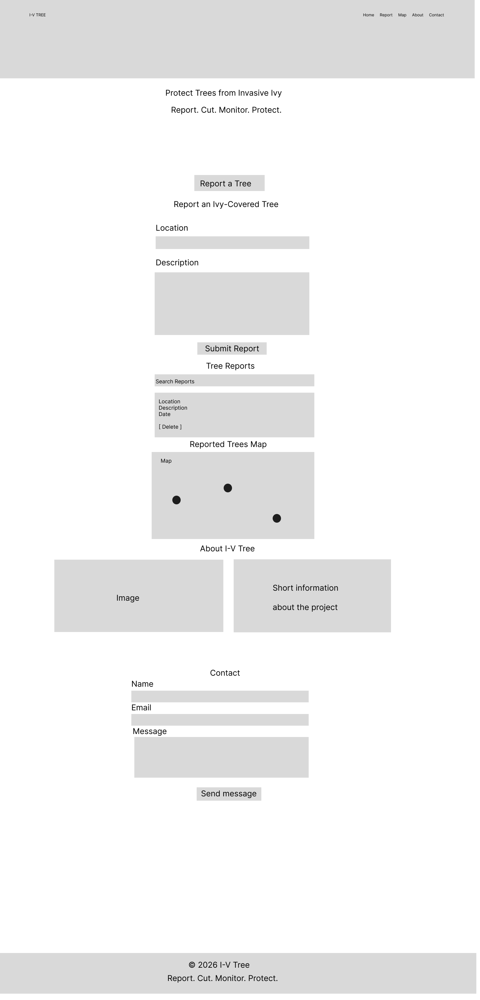
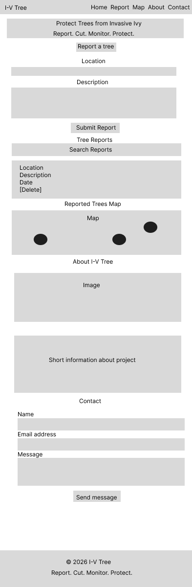

# I-V Tree

I-V Tree is a community-focused website designed to help people identify, report and monitor trees affected by invasive ivy.

The project aims to encourage local communities to take an active role in protecting trees by making it simple to report ivy-covered trees and view reported locations.

Users can submit a tree report with location information and a description. Reports are displayed on the website and represented by markers on the Tree Report Map. Reports are stored locally in the user's browser so that they remain available when the page is refreshed.

The website also provides information about why managing heavy ivy growth can be important and promotes the I-V Tree message:

**Report. Cut. Monitor. Protect.**

## User Experience (UX)

### Project Goals

The main goal of I-V Tree is to provide a simple and accessible way for users to report and monitor trees affected by invasive ivy.

The website was designed with the following goals:

- Make reporting an ivy-covered tree quick and straightforward.
- Allow users to view previously submitted reports.
- Display reported trees visually on a map.
- Help users understand why managing invasive ivy is important.
- Encourage community involvement in protecting local trees.
- Provide a responsive layout that works across desktop, tablet and mobile devices.

### Target Audience

I-V Tree is aimed at people who care about their local environment and want a simple way to help protect trees from invasive ivy.

The target audience includes:

- Local residents who notice ivy-covered trees in their area.
- Community and environmental groups.
- Volunteers interested in protecting local green spaces.
- People who want to report affected trees without needing specialist knowledge.
- Users who want to monitor reports and see where affected trees have been identified.

### User Stories

#### Reporting a Tree
- As a user, I want to report an ivy-covered tree by providing its location and a description so that it can be recorded and monitored.

#### Viewing Reports
- As a user, I want to see how many tree reports have been submitted.
- As a user, I want to search reports by location so that I can find relevant trees quickly.

#### Using the Map
- As a user, I want to view reported trees on a map so that I can see where affected trees have been identified.

#### Managing Reports
- As a user, I want to delete a report if it has been added incorrectly.

#### Learning About I-V Tree
- As a user, I want to understand the purpose of I-V Tree when I first visit the website.
- As a user, I want to learn why managing heavy ivy growth can help protect trees.

#### Getting Involved
- As a user, I want to contact I-V Tree if I have a question or want to get involved.

#### Responsive Design
- As a user, I want the website to work comfortably on desktop, tablet and mobile devices.

## Design

### Colour Scheme

The I-V Tree colour scheme uses natural greens, neutral backgrounds and white space to reflect the environmental purpose of the project.

Dark green is used throughout the navigation, headings and buttons to create a consistent visual identity and connect the website with nature and tree conservation.

Light neutral backgrounds help maintain readability and allow the photographs, illustrations and report information to stand out.

### Imagery

Images and illustrations are used throughout I-V Tree to reinforce the environmental theme and make the purpose of the website visually clear.

Custom branded assets include the I-V Tree logo, hero imagery, report map marker, empty report state, community imagery and before-and-after ivy illustrations.

Rounded corners and consistent image styling are used to maintain a cohesive appearance throughout the website.

### Wireframes

Wireframes were created during the planning stage to establish the structure and layout of the I-V Tree website before development.

The designs considered both desktop and mobile layouts to ensure that the website would remain clear, accessible and responsive across different screen sizes.

#### Desktop Wireframe

#### Mobile Wireframe

## Features

### Navigation
The navigation bar provides clear links to the main sections of the website: Home, Report, Map, About and Contact. This allows users to move quickly between sections of the single-page website.

### Hero Section
The hero section introduces the purpose of I-V Tree and displays the project message, "Report. Cut. Monitor. Protect."

A prominent "Report a Tree" button encourages users to interact with the website and takes them directly to the tree reporting feature.

### Tree Reporting Form
Users can submit a report for an ivy-covered tree by entering a location and description.

The form uses required fields to prevent incomplete reports from being submitted. When a report is successfully submitted, the location, description and date are stored and displayed in the Tree Reports section.

Reports are saved using localStorage, allowing them to remain available after the browser is refreshed.

### Tree Reports
Submitted tree reports are displayed as individual report cards containing the location, description and date of submission.

A report counter shows the number of reports currently stored.

Users can search existing reports by entering keywords into the search field, making it easier to find reports relating to a particular location or description.

Individual reports can be removed using the Delete button, while the Clear All Reports button allows all stored reports to be removed at once.

### Tree Report Map
The Tree Report Map provides a visual representation of submitted tree reports.

Each saved report creates a marker on the map. The marker remains in the same position when the page is refreshed and is automatically removed if its corresponding report is deleted.

The current map is a prototype visualisation. Marker positions do not represent exact geographic coordinates. Accurate location mapping and geocoding are planned as a future development of I-V Tree.

### About Section
The About section explains the purpose of I-V Tree and its community-focused approach to identifying and monitoring trees affected by invasive ivy.

Supporting imagery is used to reinforce the environmental and community theme of the project.

### Contact Form
The Contact section provides a simple form where users can enter their name, email address and message.

Required fields provide basic form validation. When all fields are completed and the form is submitted, the user receives a confirmation message and the form is reset.

### Responsive Design
I-V Tree uses responsive CSS to adapt the layout for different screen sizes.

A mobile media query adjusts the navigation, logo, hero section and feature cards for smaller screens. On mobile devices, navigation links wrap neatly and content is stacked vertically to improve readability and usability.

The website was manually tested using Chrome Developer Tools at desktop and mobile screen sizes, including an iPhone-sized viewport.

## Future Features
The current version of I-V Tree provides the core functionality required to demonstrate the project concept. Future development could include:

- Accurate geolocation and geocoding so that report markers correspond to real geographic locations.
- User accounts allowing people to manage and monitor their own tree reports.
- Public and private reporting options, giving users control over whether their reports are shared with the wider community.
- Photo uploads so users can provide visual evidence when reporting a tree.
- Progress updates allowing users to upload follow-up images and monitor a tree over time.
- Guidance explaining how ivy can be safely managed and when professional advice may be required.
- A community achievement system where protecting trees contributes towards growing a user's virtual oak tree.
- Expansion beyond ivy to support reporting and monitoring of other threats to trees and local environments.

## Technologies Used
- **HTML5** - Used to create the structure and content of the website.
- **CSS3** - Used to style the website and create the responsive layout.
- **JavaScript** - Used to provide interactive functionality including reports, searching, deleting reports, map markers and form behaviour.
- **localStorage** - Used to store tree reports within the user's browser so that data persists after refreshing the page.
- **Git** - Used for version control throughout development.
- **GitHub** - Used to store the project repository and track development through commits.
- **Figma** - Used to create desktop and mobile wireframes.
- **Chrome Developer Tools** - Used to test and improve the responsive layout at different screen sizes.
- **Visual Studio Code** - Used to develop and manage the project files.

## Testing
Testing was carried out throughout development to ensure that the main features worked as expected.

### Manual Testing
| Feature | Test | Expected Result | Result |
|---|---|---|---|
| Report form | Submit a valid location and description | New report is displayed | Pass |
| Form validation | Submit the report form with required information missing | Browser prevents submission | Pass |
| Report persistence | Refresh the browser after creating a report | Report remains available | Pass |
| Report counter | Add and remove reports | Counter updates correctly | Pass |
| Search | Search using report location or description | Matching reports are displayed | Pass |
| Delete report | Delete an individual report | Report and corresponding map marker are removed | Pass |
| Clear all reports | Create multiple reports and select Clear All Reports | All reports and map markers are removed | Pass |
| Map persistence | Refresh after creating a report | Report marker remains in the same position | Pass |
| Navigation | Select Home, Report, Map, About and Contact links | Page moves to the correct section | Pass |
| Report button | Select Report a Tree | Reporting form is displayed | Pass |
| Contact validation | Submit the Contact form with empty required fields | Browser prevents submission | Pass |
| Contact form | Complete and submit the Contact form | Confirmation appears and form resets | Pass |
| Mobile layout | Test using an iPhone-sized viewport | Content fits without horizontal overflow | Pass |

### Responsive Testing
The website was tested at different viewport sizes using Chrome Developer Tools.

During mobile testing, the navigation links extended beyond the available screen width and the feature cards became too narrow when displayed side-by-side.

A CSS media query was added for screens up to 600px wide. This changed the navigation to a mobile-friendly layout, allowed the navigation links to wrap and stacked the feature cards vertically.

The website was then retested using an iPhone-sized viewport. The navigation, hero section, forms, report content, map, images and Contact section displayed correctly without horizontal overflow.

### Bugs and Fixes
Several issues were identified and resolved during development:

- **Map marker background:** An early map marker image displayed with an unwanted white background. The asset was replaced with a transparent PNG and the marker CSS was adjusted to remove background, padding, borders and shadows.

- **Map marker persistence:** Report markers originally received a new random position whenever the page was refreshed. Map position values were added to each report when it is created and stored with the report in localStorage, allowing markers to remain in the same position.

- **Report and map synchronisation:** Map markers did not initially update whenever reports were deleted or cleared. The map display function was added to the delete and Clear All functionality so that reports and markers remain synchronised.

- **Mobile navigation:** During responsive testing, some navigation links extended beyond the mobile viewport. A media query was added to allow the navigation to wrap and display correctly on smaller screens.

- **Mobile feature cards:** The feature cards became too narrow when displayed side-by-side on mobile. The responsive layout was changed so that the cards stack vertically on smaller screens.

## Deployment
The project is stored in a GitHub repository and version control was used throughout development.

Changes were committed regularly using Git to create a record of the development process.

### GitHub Pages

The finished website can be deployed using GitHub Pages so that it can be viewed online directly from the project repository.

## Credits

### Content

All written content for I-V Tree was created specifically for this project.

### Media

Custom images and visual assets were created for the I-V Tree project and are stored within the project's assets folder.

### Acknowledgements

The project was developed as part of my coursework and was influenced by an interest in protecting trees and encouraging community involvement in local environmental issues.

## Project Status
I-V Tree is currently a working prototype demonstrating the core concept of reporting and monitoring trees affected by invasive ivy.

The current version includes tree reporting, persistent report storage, report searching and management, a prototype report map, responsive design, project information and a Contact form.

Further development could expand the project with accurate geolocation, user accounts, image uploads and long-term tree monitoring.